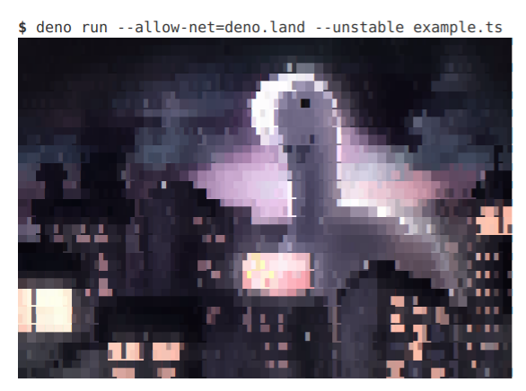
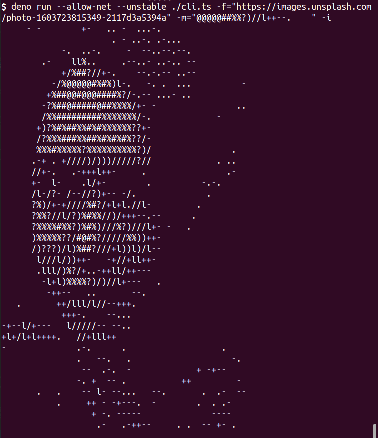
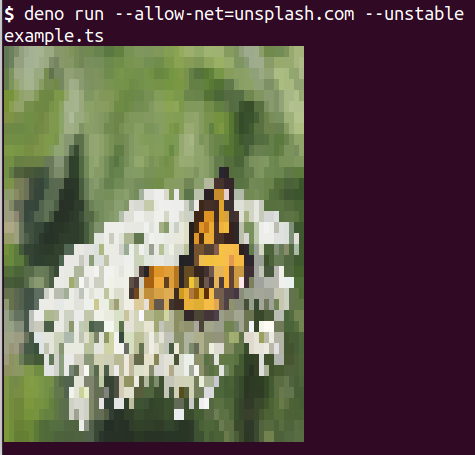

# terminal_images

**terminal_images** is a Deno module and CLI tool, written in TypeScript, for displaying images in the terminal.

Currently only PNG and JPG images are supported.

To install the CLI tool, run the following from the command line:

```shell
deno install --allow-read --allow-net --unstable --force https://x.nest.land/terminal_images@2.1.1/cli.ts
```

Then run

```shell
terminal_images --file="https://deno.land/images/hashrock_simple.png" --character-map="   % @"
```

...and you should see something like this displayed in your terminal:

```
                 @@@@@@@@@@@@@@                 
            @@@@@@@@ @@    @@@@@@@@@            
         @@@@@       @@    @@     @@@@@         
       @@@@         @@@              @@@@       
     @@@@ @@@       @@                 @@@@     
    @@@   @@@                  @@        @@@    
  @@@@@  @@@      %%%%%%%%%%  @@@         @@@@  
  @@@@   @@   %%%%%%%%%%%%%%%%%%       @@  @@@  
 @@@        %%%%%%%%%%%%%%%%%%%%%%    @@@   @@@ 
@@@        %%%%%%%%%%%%   %%%%%%%%%   @@     @@@
@@@       %%%%%%%%%%%%%%%%%%%%%%%%%% @@@     @@@
@@@     @ %%%%%%%%%%%%%%%%%%%%%%%%%%%     @@@@@@
@@@    @@ %%%%%%%%%%%%%%%%%%%%%%%%%%%%    @@@@@@
@@@   @@@ %%%%%%%%%%%%%%%%%%%%%%%%%%%%    @@ @@@
@@@   @@    %%%%%%%%%%%%%%%%%%%%%%%%%%%  @@  @@@
 @@@  @     @@%%%%%%%%%%%%%%%%%%%%%%%%%     @@@ 
  @@@      @@@         %%%%%%%%%%%%%%%%%   @@@  
  @@@@     @@           %%%%%%%%%%%%%%%%  @@@@  
    @@@    @@         @@%%%%%%%%%%%%%%%%%@@@    
     @@@@       @@   @@@ %%%%%%%%%%%%%% @@@     
       @@@@    @@@   @@  %%%%%%%%%%%%@@@@       
         @@@@@@@@   @@@   %%%%%%%%@@@@@         
            @@@@@@@@      %% @@@@@@@            
                 @@@@@@@@@@@@@@                 
```

_Note that the size might be different, as by default it adapts to the size of your terminal._

 You can also use the module, which has exports two functions: `getImageString` and `printImageString`, which both take in an object with the same properties.

 Here is an example of how you can use it:

 ```ts
import { printImageString } from "https://x.nest.land/terminal_images@2.1.1/mod.ts";

printImageString({

  // replace this with the URL or local file path of the image you want to print out
  path: "https://deno.land/images/deno_city.jpeg",

  // when true the output will be in color
  color: true,

  // by default the size of the image is set to fit in the terminal,
  // but you can override it with the width property
  width: 56
})
```

This should output something like this:



## API

| Property | Type | Description | Default Value | CLI Flag |
|-|-|-|-|-|
| `path` | string | The path or URL of the input image. | No default | `--file` or `-f` |
| `rawFile` | UintArray | The raw data of the input image. (You can use this instead of `path`) | No default | [No CLI flag] |
| `rawPixels` | {data: UintArray, width: number, height: number} | The rgb(a) data (as well as the height and width) of the input image. (You can use this instead of `path` or `rawFile`) | No default | [No CLI flag] |
| `color` | boolean | Whether the output should be in color. | `false` | `--color` or `-c` |
| `characterMap` | string \| string[] | See the section on character maps for more information. | By default a character map isn't used, and high-res mode is used instead. | `--character-map` or `-m` |
| `inverted` | boolean | Whether the character map should be mapped from light to dark instead of dark to light. Normally you will want to set this to true if your terminal is in a dark theme. | `false` | `--inverted` or `-i` |
| `width` | number | The number of characters wide the image should be. | The maximum value where all of the image is visible at once | `--width` or `-w` |

_Because the size of the image automatically adapts to the size of your console, the image produced will have a higher resolution (unless you have manually set `width`) if the font size is smaller and the terminal window is larger, as more can fit on the screen._

## Character map?

The "character map" is the characters that are used to display the image. _If no character map is specified, it will default to high(er) resolution mode--see the module usage example above._

The characters at the beginning of the character map should be the darkest and the ones at the end be the lightest. You can switch this around by using the `inverted` flag/property.

If you are using the module, you can set the character map to an array of strings, where each element will be used as a pixel color (rather than each character of the string).

### Some tips for using character maps:

* Simple images with recognisable shapes and high contrast work the best. (Although if you aren't aiming for functionality, go wild!)
* Normally you will want to invert the character map if your terminal is in a dark theme.
* You can generate ASCII art by using character maps such as `"@#?)l+-. "` and blocky images using character maps like `█▓▒░ `.
* Make sure you have escaped any characters you need to with a backslash (`\`).
* You don't have to sort your characters from darksest to lightest or vice versa. Play around with what works for specfic images, and see if you can create any interesting effects.
* Padding your character maps can be useful when brightness is not evenly distributed. For example, if your image has mostly dark tones, then your character map might have some extra spaces on the end, so that it is easier to distinguish between darker colors than lighter ones.
* Try to make characters next to each other in the character map similar. For example, don't put a `.` after a `'` as one is displayed much lower down than the other.

## Required Permissions

|Flag| R |Reason|
|:--|:-:|:--|
| `--unstable` | * | To detect the size of your terminal |
| `--allow-net` | _ | To fetch images from the web |
| `--allow-read` | _ | To use images stored locally |

Either `--allow-net` or `--allow-read` is needed when using `path` (`--file` in the CLI tool). When using `rawFile` or `rawPixels`, only the `--unstable` flag is needed.

## Examples




For more example outputs, have a look at the images folder.

## Todo

* [X] Add some color
* [X] Publish to nest.land
* [X] Add support for using images loaded from the web (rather than just locally)
* [X] Auto-detect file format (no need to rely on the file extension)
* [X] Allow the user to input an array of strings for the character map [added, but user can't do this when using the cli]
* [X] Finish the documentation in README.md
* [X] Add jsdoc documentation in the code
* [X] Add support for unicode characters
* [X] Add high(er) resolution output mode
* [X] Correctly handle characters such as emojis that have a width that isn't 1
* [ ] Add some tests (this might be diffult as detecting the terminal size won't work)
* [ ] Don't count modifier characters (e.g. emoji skin tones) as separate characters (unless they aren't modifying anything and are visible)
* [ ] Deal with transparency better (especially for high-res mode)
* [ ] Option for width as a percentage of terminal screen
* [ ] Detect whether terminal theme is light or dark automatically?
* [ ] Better error handling (e.g. 404 when fetching image)
* [ ] Add support for webp images
* [ ] Add support for GIF images
* [ ] Add support for TIFF images

## Contributions

Contributions are welcome! Just pick something to do (the todo list above is a good starting point) and let me know you want to work on it by opening an issue or commenting on a relevant existing issue.

If you think you have found a bug, please open an issue (after checking for similar issues).

## License

**terminal_images** is under the open source MIT license. See the LICENSE file for legal words.